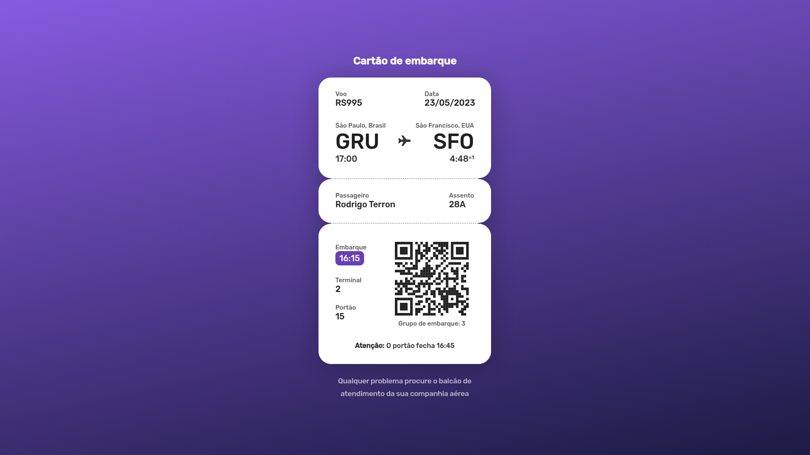
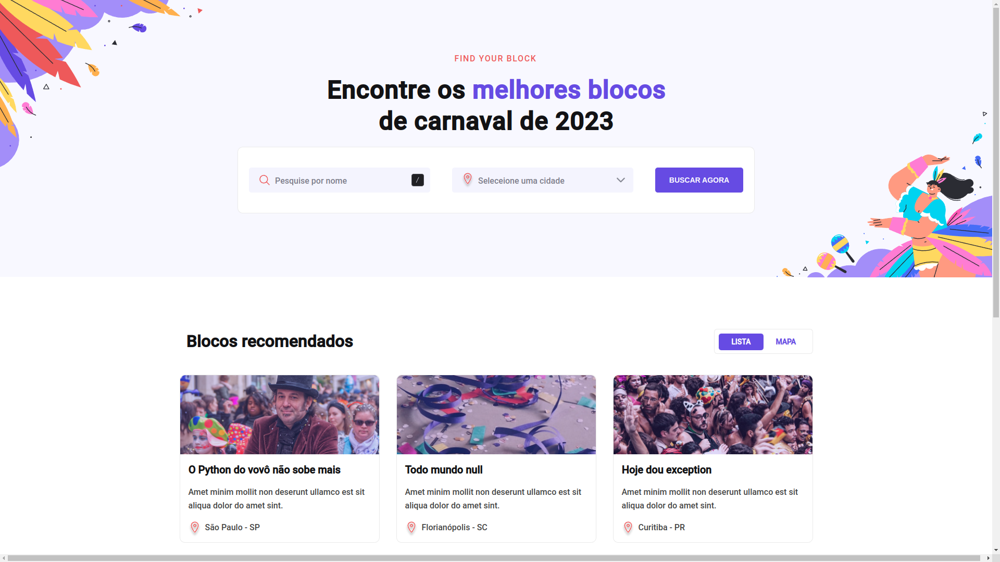
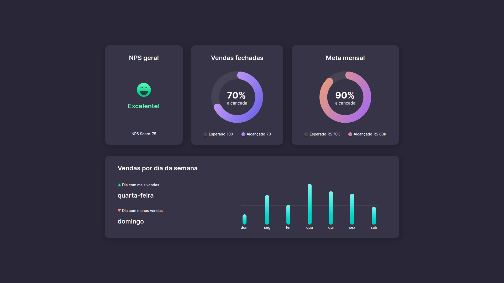
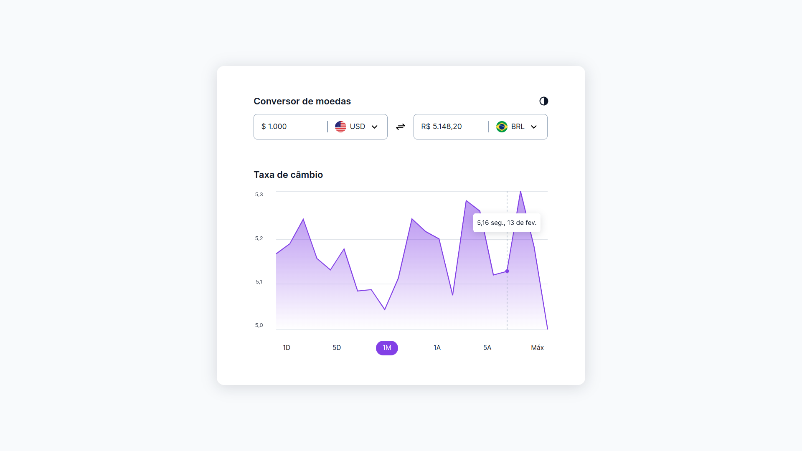

# #boraCodar

    Projetos #boraCodar da Rocketseat  
     <table>
    <thead>
        <tr>
            <th align="center">
                 
                
 
                    <small>
                        NAME
                    </small>
                

            </th>
            <th align="left">
                
                
 
                    <small>
                    RELEASE DATE
                    </small>
                

            </th>
            <th align="center">
                
                
 
                    <small>
                    PREVIEW
                    </small>
                

            </th>
        </tr>
    </thead>
    <tbody>
        <tr>
            <td><a href="05">Calculadora</a></td>
            <td>03/02/23</td>
            <td align="center" ></td>
        </tr>
        <tr>
            <td><a href="06">Ticket de embarque</a></td>
            <td>14/02/23</td>
            <td align="center" ></td>
        </tr>
        <tr>
            <td><a href="07">Site para encontrar blocos no carnaval</a></td>
            <td>17/02/23</td>
            <td align="center" ></td>
        </tr>
        <tr>
            <td><a href="08">Dashboard</a></td>
            <td>26/02/23</td>
            <td align="center" ></td>
        </tr>
        <tr>
            <td><a href="09">Conversor de moedas</a></td>
            <td>08/03/23</td>
            <td align="center" ></td>
        </tr>
    </tbody>
</table>
